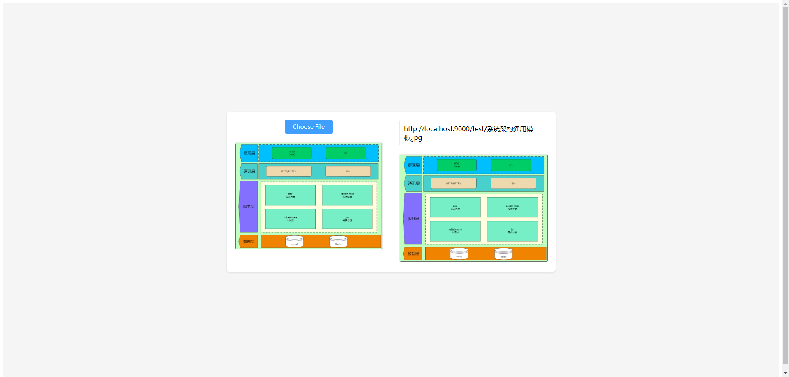
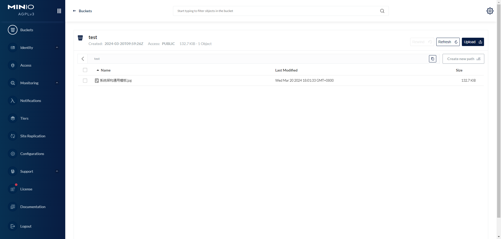

# Minio-Demo

## 项目介绍

golang实现的minio对象存储服务的demo

## 快速开始

1. 运行docker-compose.yml文件启动minio服务

```shell
docker-compose up -d
```

2. 运行main.go文件启动服务

```shell
go run main.go
```

3. 在浏览器打开index.html文件，测试上传文件

这里你可以借助vscode或者其他编辑器的插件，直接在浏览器中打开index.html文件

## 效果图



